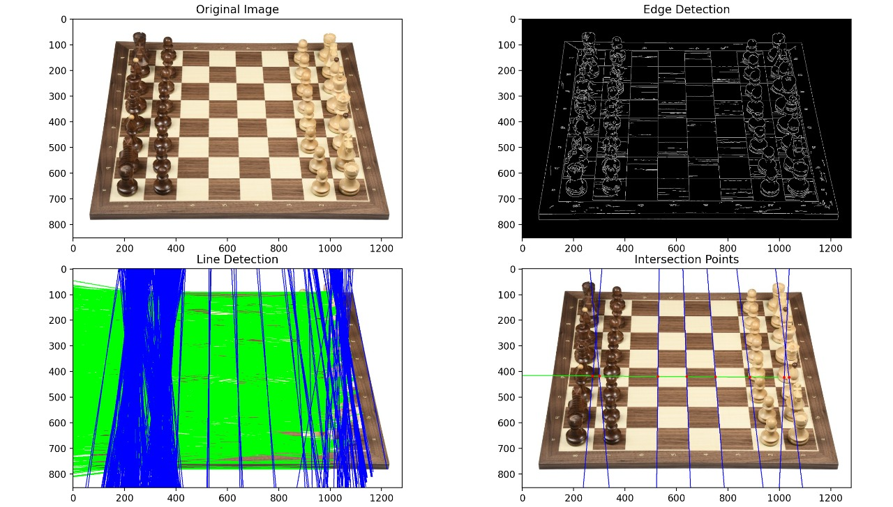

<<<<<<< HEAD
# Computer-Vision
Chess playing Robot 

# Computer-Vision
Chess playing Robot 
=======
# Computer-Vision

Chess playing Robot

## Board Localisation

This module identifies and localizes the chess board in an image by detecting its edges and grid intersection points.

### CANNY EDGE DETECTOR:

1. **Noise Reduction (Gaussian filter)**: Smooths the image to remove noise.
2. **Finding Intensity Gradient (Sobel operator)**: Calculates gradient magnitude and direction.
3. **Non-Maximum Suppression (NMS)**: Thins edges by selecting pixels with maximum gradient magnitude.
4. **Double Thresholding**: Classifies pixels as strong, weak, or non-edges.
5. **Edge Tracking by Hysteresis**: Finalizes edge detection by including weak edges connected to strong edges.

### HOUGH TRANSFORM:

- A line in the image can be represented in parameter space.
- Instead of looking at pixels in the image, we look at which parameters (θ, ρ) define possible lines passing through those pixels.
- Then, we vote in an accumulator array for the parameters.
- Peaks in the accumulator → detected lines.

### Board Detection Process:

>>>>>>> 43d1f27 (Feat: Code for the board localisation along with the results)
